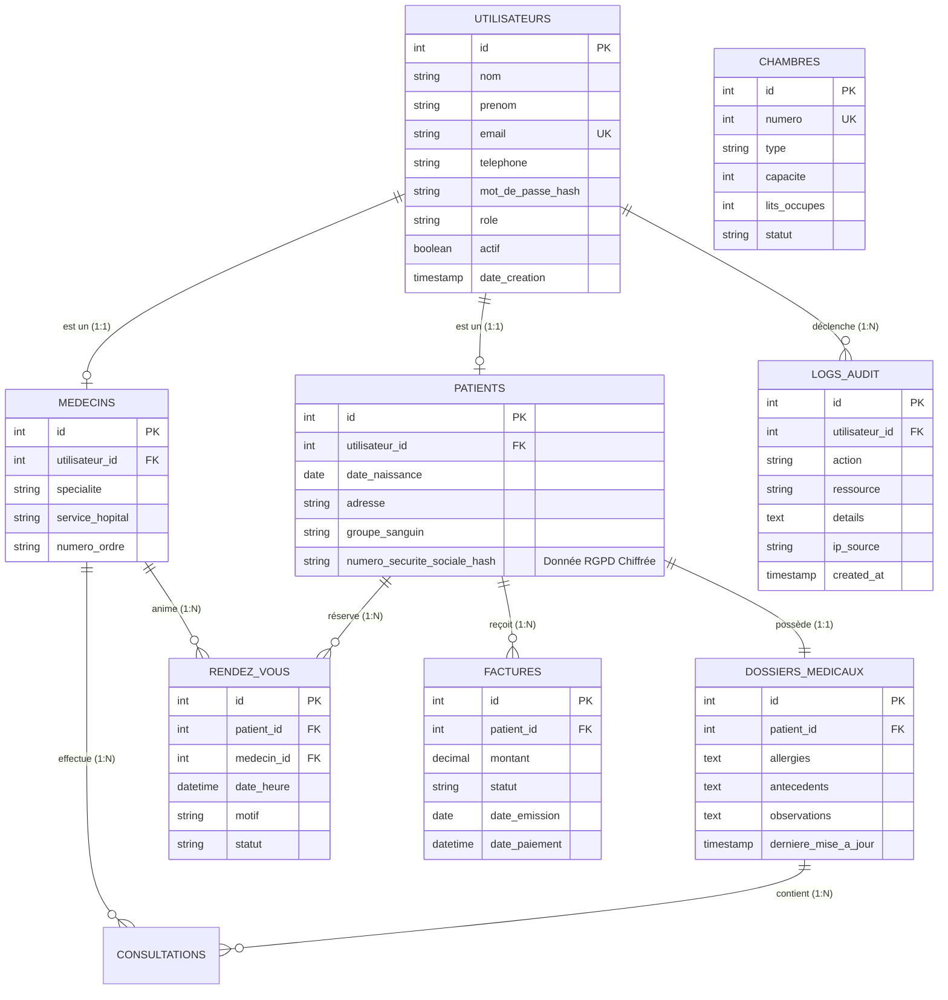

# 🏥 Gestion-d-Hopitale — Système d'Information Hospitalier (SIH)

[](https://openjdk.org/)
[](https://www.docker.com/)
[](https://www.mysql.com/)
[-0052CC?style=for-the-badge&logo=shield&logoColor=white)](#-sécurité--conformité-rgpd)
[](#-architecture-technique--concurrence)

> **Gestion-d-Hopitale** est une solution backend robuste conçue pour la gestion hospitalière critique (patients, consultations, admissions en chambre et facturation transactionnelle). Développée selon les standards stricts du **RGPD** et de la **sécurité des données de santé**, l'application garantit une intégrité totale des transactions grâce à des mécanismes avancés de synchronisation multi-thread (`Semaphore`, `ReentrantLock`, `Runnable`).

---

## 📌 Sommaire

- [Valeur Métier & Fonctionnalités](#-valeur-métier--fonctionnalités)
- [Modèle de Données & Schéma Relationnel (Mermaid ERD)](#-modèle-de-données--schéma-relationnel)
- [Architecture Technique & Concurrence Multi-Thread](#-architecture-technique--concurrence)
- [Sécurité & Conformité RGPD](#-sécurité--conformité-rgpd)
- [Démarrage Rapide](#-démarrage-rapide)
  - [Option 1 : Déploiement Docker & Docker Compose (Recommandé)](#option-1--déploiement-docker-compose-recommandé)
  - [Option 2 : Exécution Locale avec Java 21](#option-2--exécution-locale-avec-java-21)
- [Variables d'Environnement](#-variables-denvironnement)
- [Structure du Projet](#-structure-du-projet)

---

## 💼 Valeur Métier & Fonctionnalités

Dans un environnement hospitalier à flux continu, la gestion manuelle ou mal synchronisée entraîne des erreurs critiques : surréservation de lits, double facturation ou fuite de données médicales sensibles. Cette plateforme résout ces problématiques :

1. **Gestion des Patients & Dossiers Médicaux Partagés (DMP)** :
   - Inscription et suivi complet du cycle de vie des patients.
   - Historique médical protégé (antécédents, allergies, observations cliniques).
   - Pseudonymisation systématique du Numéro d'Inscription au Répertoire (NIR / Sécurité Sociale).

2. **Planification Asynchrone des Rendez-Vous** :
   - Prise de rendez-vous avec praticiens par spécialité (Cardiologie, Chirurgie, Soins Intensifs).
   - Traitement asynchrone des confirmations et notifications via des threads dédiés (`Runnable`).

3. **Régulation des Lits & Admissions (Contrôle d'Accès Concurrent)** :
   - Prévention mathématique de la surcapacité des chambres grâce à un `Semaphore` équitable.
   - Gestion des flux d'entrées et de sorties en temps réel.

4. **Module Financier & Règlements Sécurisés** :
   - Génération et suivi des factures de consultations et séjours.
   - Protection absolue contre le double paiement (double charge / race conditions) par verrou réentrant (`ReentrantLock`).

5. **Piste d'Audit & Gouvernance des Données** :
   - Journalisation indélébile de tout accès, modification ou extraction de dossier patient (conforme aux exigences de la CNIL et du RGPD).

---

## 🗄️ Modèle de Données & Schéma Relationnel

Le schéma relationnel repose sur un modèle normalisé en 3NF (Troisième Forme Normale) assurant intégrité référentielle, indexation pour les requêtes à forte fréquence et séparation stricte des informations administratives et médicales.



---

## ⚡ Architecture Technique & Concurrence Multi-Thread

Le backend tire parti des primitives de bas niveau du package `java.util.concurrent` pour garantir performance et sécurité opérationnelle :

```mermaid
flowchart TD
    subgraph MultiThreading ["Gestion Concurrente Haute Performance"]
        direction TB

        subgraph S1 ["1. Régulation des Admissions en Chambre"]
            A["Patients Arrivants (Threads)"] --> B["Chambre : Semaphore(Capacité N, FIFO)"]
            B -->|Permit Accordé| C["Lit Occupé / Patient Alité"]
            C -->|Sortie du Patient| D["Semaphore.release() / Place Libérée"]
            B -->|Permit Épuisé| E["Mise en file d'attente sécurisée"]
        end

        subgraph S2 ["2. Traitement Financier Idempotent"]
            F["Tentatives de Paiement Concurrente"] --> G["Facture : ReentrantLock"]
            G --> H{"Facture déjà PAYÉE ?"}
            H -->|Non| I["Validation & Enregistrement Règlement"]
            H -->|Oui| J["Rejet Immédiat (Prévention Double Débit)"]
            I --> K["Lock.unlock()"]
            J --> K
        end

        subgraph S3 ["3. File Asynchrone des Rendez-Vous"]
            L["Demande de RDV"] --> M["Thread Dédié (implements Runnable)"]
            M --> N["Contrôle Disponibilité & Notification Asynchrone"]
            N --> O["Mise à jour Statut: CONFIRMÉ"]
        end
    end
```



---

## 🔒 Sécurité & Conformité RGPD

Ce projet manipule des données à caractère personnel et médical hautement sensibles. En accord avec le **Règlement Général sur la Protection des Données (RGPD)** :

| Exigence Légale | Article RGPD | Implémentation dans le Code |
| :--- | :--- | :--- |
| **Sécurité des Mots de Passe** | Art. 32 | Hachage cryptographique **SHA-256 avec sel applicatif**. Aucun mot de passe en clair. |
| **Pseudonymisation des Données** | Art. 4(5) & 32 | Masquage du numéro de sécurité sociale (`185******5678`) et des emails dans les logs et affichages. |
| **Piste d'Audit & Traçabilité** | Art. 30 | Journalisation (`SecurityUtils.logAudit`) de chaque création de compte, accès dossier médical ou modification de prescription. |
| **Séparation des Secrets** | 12-Factor App | Externalisation intégrale des identifiants SQL et clés secrètes dans des variables d'environnement (`.env`). |
| **Isolement des Processus** | Bonnes Pratiques | Conteneur Docker exécuté sous un compte utilisateur non privilégié (`appuser`, UID 1001). |

---

## 🚀 Démarrage Rapide

### Option 1 : Déploiement Docker Compose (Recommandé)

Le fichier `docker-compose.yml` orchestre à la fois l'application Java 21 et la base de données relationnelle MySQL 8.0 avec initialisation automatique du schéma.

1. **Cloner le dépôt et copier la configuration** :
   ```bash
   git clone https://github.com/tahalrh/Gestion-d-Hopitale.git
   cd Gestion-d-Hopitale
   cp .env.example .env
   ```

2. **Démarrer l'infrastructure complète** :
   ```bash
   docker compose up --build
   ```

3. **Vérifier l'état des conteneurs** :
   ```bash
   docker compose ps
   ```

4. **Arrêter l'infrastructure** :
   ```bash
   docker compose down -v
   ```

---

### Option 2 : Exécution Locale avec Java 21

Si vous disposez d'un JDK 21 ou supérieur sur votre machine hôte :

1. **Compilation des modules Java** :
   ```bash
   # Création du répertoire de sortie
   mkdir -p bin

   # Compilation de tous les packages
   javac -d bin module-info.java app/Main.java config/*.java model/*.java security/*.java service/*.java
   ```

2. **Exécution de l'application** :
   ```bash
   java -cp bin app.Main
   ```

3. **(Optionnel) Création d'un JAR exécutable autonome** :
   ```bash
   jar --create --file gestion-hopital.jar --main-class app.Main -C bin .
   java -jar gestion-hopital.jar
   ```

---

## ⚙️ Variables d'Environnement

Le fichier `.env` configure l'intégralité des accès sans modifier le code source :

| Variable | Description | Valeur par Défaut |
| :--- | :--- | :--- |
| `DB_HOST` | Hôte du serveur MySQL | `db` (ou `localhost` en local) |
| `DB_PORT` | Port d'écoute SQL | `3306` |
| `DB_NAME` | Nom de la base de données | `hopital_db` |
| `DB_USER` | Utilisateur applicatif | `hopital_user` |
| `DB_PASSWORD` | Mot de passe applicatif | `HopitalSecurite2026!` |
| `DB_ROOT_PASSWORD` | Mot de passe administrateur MySQL | `RootAdminHopital2026!` |
| `APP_ENV` | Environnement d'exécution | `production` |
| `APP_PORT` | Port exposé par le conteneur | `8080` |
| `DATA_ENCRYPTION_KEY` | Clé secrète de chiffrement des données | Clé Base64 256 bits |
| `AUDIT_LOG_ENABLED` | Activation de la piste d'audit RGPD | `true` |

---

## 📂 Structure du Projet

```text
Gestion-d-Hopitale/
├── .github/
│   └── workflows/
│       └── ci.yml               # Pipeline CI GitHub Actions (Build, JAR, Docker)
├── app/
│   └── Main.java                # Point d'entrée & démonstration multi-thread
├── config/
│   ├── DatabaseConnection.java  # Connexion JDBC sécurisée & résiliente
│   └── EnvConfig.java           # Chargeur 12-factor sans dépendance (.env)
├── model/
│   ├── Administrateur.java      # Rôle administratif & gestion des accès
│   ├── Chambre.java             # Contrôle de flux avec Semaphore
│   ├── DossierMedical.java      # Dossier médical partagé protégé (RGPD)
│   ├── Facture.java             # Verrouillage financier avec ReentrantLock
│   ├── Medecin.java             # Praticiens, consultations et ordonnances
│   ├── Patient.java             # Entité patient avec NIR pseudonymisé
│   ├── RendezVous.java          # Traitement asynchrone (Runnable)
│   └── Utilisateur.java         # Classe mère abstraite & hachage SHA-256
├── security/
│   └── SecurityUtils.java       # Hachage, masquage de données & Audit RGPD
├── service/
│   ├── PatientService.java      # Opérations CRUD patients & registre
│   └── UtilisateurService.java  # Annuaire sécurisé & contrôle d'authentification
├── sql/
│   └── init.sql                 # Schéma DDL relationnel & données d'amorce
├── .env.example                 # Modèle des variables d'environnement
├── .gitignore                   # Exclusion stricte des secrets et artefacts
├── Dockerfile                   # Build multi-stage Java 21 non-root
├── docker-compose.yml           # Stack applicative et base de données MySQL
├── module-info.java             # Déclaration modulaire Java
└── README.md                    # Documentation métier & technique
```

---

## 👨‍💻 Auteur & Licence

- **Auteur** : [Taha El Rhayyate](https://github.com/tahalrh)
- **Licence** : Projet distribué sous licence MIT. Libre pour consultation et évaluation professionnelle.
